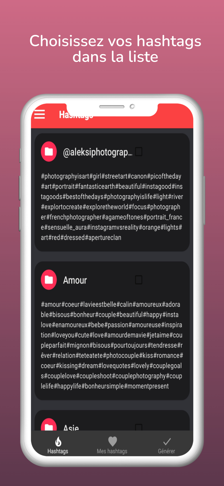
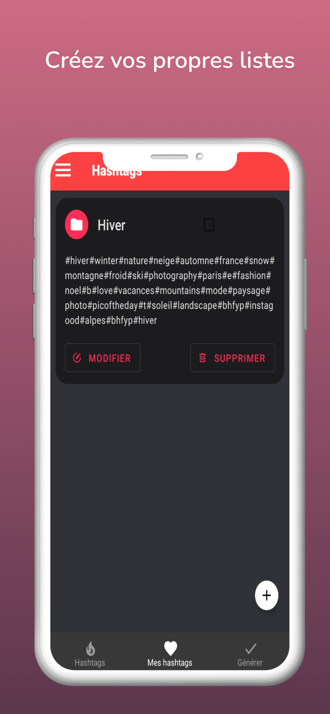
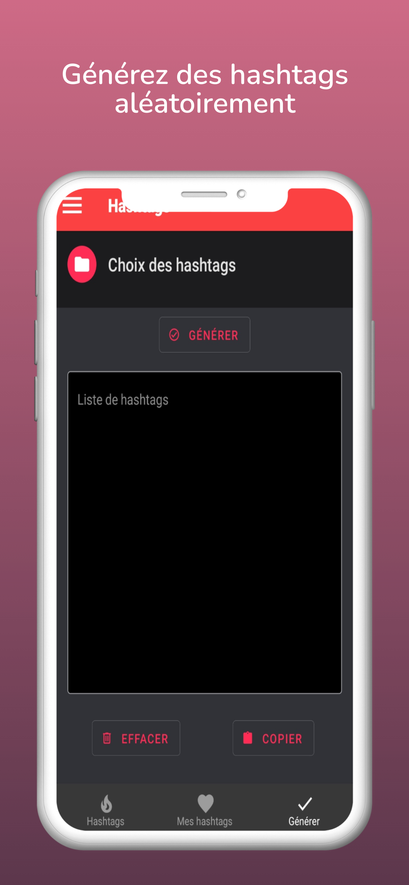

<!--
*** Thanks for checking out the hashtagramy. If you have a suggestion
*** that would make this better, please fork the repo and create a pull request
*** or simply open an issue with the tag "enhancement".
*** Thanks again! Now go create something AMAZING! :D
-->

<!-- PROJECT SHIELDS -->
<!--
*** I'm using markdown "reference style" links for readability.
*** Reference links are enclosed in brackets [ ] instead of parentheses ( ).
*** See the bottom of this document for the declaration of the reference variables
*** for contributors-url, forks-url, etc. This is an optional, concise syntax you may use.
*** https://www.markdownguide.org/basic-syntax/#reference-style-links
-->

[![Contributors][contributors-shield]][contributors-url]
[![Forks][forks-shield]][forks-url]
[![Stargazers][stars-shield]][stars-url]
[![Issues][issues-shield]][issues-url]
[![MIT License][license-shield]][license-url]
[![LinkedIn][linkedin-shield]][linkedin-url]

<!-- PROJECT LOGO -->
<br />
<p align="center">
  <a href="https://github.com/camille/hashtagramy">
    
  </a>

  <h3 align="center">Hashtagramy</h3>

  <p align="center">
    Une application react native pour aider les utilisateurs dans la création de contenu pour les réseaux sociaux.
    <br />
    <a href="https://github.com/camillevingere/hashtagramy"><strong>Explorer la doc »</strong></a>
    <br />
    <br />
    <a href="https://github.com/camillevingere/hashtagramy">Voir la démo</a>
    ·
    <a href="https://github.com/camillevingere/hashtagramy/issues">Reporter un bug</a>
    ·
    <a href="https://github.com/camillevingere/hashtagramy/issues">Reporter une fonctionnalité</a>
  </p>
</p>

<!-- TABLE OF CONTENTS -->
<details open="open">
  <summary>Table des matières</summary>
  <ol>
    <li>
      <a href="#le-projet">Le projet</a>
      <ul>
        <li><a href="#réalisé-avec">Réalisé avec</a></li>
      </ul>
    </li>
    <li>
      <a href="#pour-commencer">Pour commencer</a>
      <ul>
        <li><a href="#installation">Installation</a></li>
      </ul>
    </li>
    <li><a href="#contact">Contact</a></li>
  </ol>
</details>

<!-- ABOUT THE PROJECT -->

## Le projet

<p align="left">
  <a href="https://github.com/camille/hashtagramy">
    
    
    
  </a>

<!--[![Product Name Screen Shot][product-screenshot]](https://vingere.com)-->

Cette application react native a pour but d'aider les utilisateurs dans la création de contenu pour les réseaux sociaux.

### Réalisé avec

Ce projet a été réalisé avec les technologies suivantes

- [React native](https://reactnative.dev/)
- [Bootstrap](https://getbootstrap.com/)
- [Redux](https://redux.js.org/)
- [Firebase](https://firebase.google.com/?hl=FR/)

<!-- GETTING STARTED -->

## Pour commencer

Il est nécéssaire d'installer React Native et d'avoir une base de donnée sur Firebase pour faire fonctionner le projet.

### Installation

1. Cloner le dépôt
   ```sh
   git clone https://github.com/camillevingere/hashtagramy.git
   ```
2. Aller dans le répertoire principal du projet.
   ```sh
   cd hashtagramy
   ```
3. Installer toutes les dépendances nécessaire au fonctionnement du projet.
   ```sh
   expo install @react-navigation/material-bottom-tabs @expo/ngrok @expo/vector-icons @react-native-async-storage/async-storage @react-native-community/async-storage @react-navigation/drawer expo-checkbox @react-navigation/material-bottom-tabs @react-navigation/native @react-navigation/stack expo-permissions firebase firebase-admin pod-install react-native-bootstrap-styles react-native-elements react-native-gesture-handler react-native-paper react-native-range-slider-expo react-navigation @react-native-community/slider react-redux redux redux-persist
   ```
4. Mettre vos clées API Firebase dans le dossier YourConfig.js.
5. Dans MyTabs.js, remplacer :
   ```sh
   import { firebase } from "../firebase/config";
   ```
   Par :
   ```sh
   import { firebase } from "../firebase/YourConfig";
   ```

<!-- CONTACT -->

## Contact

Camille Vingere - camille.vingere@gmail.com

Lien du projet: [https://github.com/camillevingere/hashtagramy](https://github.com/camillevingere/hashtagramy)

<!-- MARKDOWN LINKS & IMAGES -->
<!-- https://www.markdownguide.org/basic-syntax/#reference-style-links -->

[contributors-shield]: https://img.shields.io/github/contributors/camillevingere/hashtagramy.svg?style=for-the-badge
[contributors-url]: https://github.com/camillevingere/hashtagramy/graphs/contributors
[forks-shield]: https://img.shields.io/github/forks/camillevingere/hashtagramy.svg?style=for-the-badge
[forks-url]: https://github.com/camillevingere/hashtagramy/network/members
[stars-shield]: https://img.shields.io/github/stars/camillevingere/hashtagramy.svg?style=for-the-badge
[stars-url]: https://github.com/camillevingere/hashtagramy/stargazers
[issues-shield]: https://img.shields.io/github/issues/camillevingere/hashtagramy.svg?style=for-the-badge
[issues-url]: https://github.com/camillevingere/hashtagramy/issues
[license-shield]: https://img.shields.io/github/license/camillevingere/hashtagramy.svg?style=for-the-badge
[license-url]: https://github.com/camillevingere/hashtagramy/blob/master/LICENSE.txt
[linkedin-shield]: https://img.shields.io/badge/-LinkedIn-black.svg?style=for-the-badge&logo=linkedin&colorB=555
[linkedin-url]: https://www.linkedin.com/in/camille-vingere/
[product-screenshot]: assets/screenshot-1.jpeg
